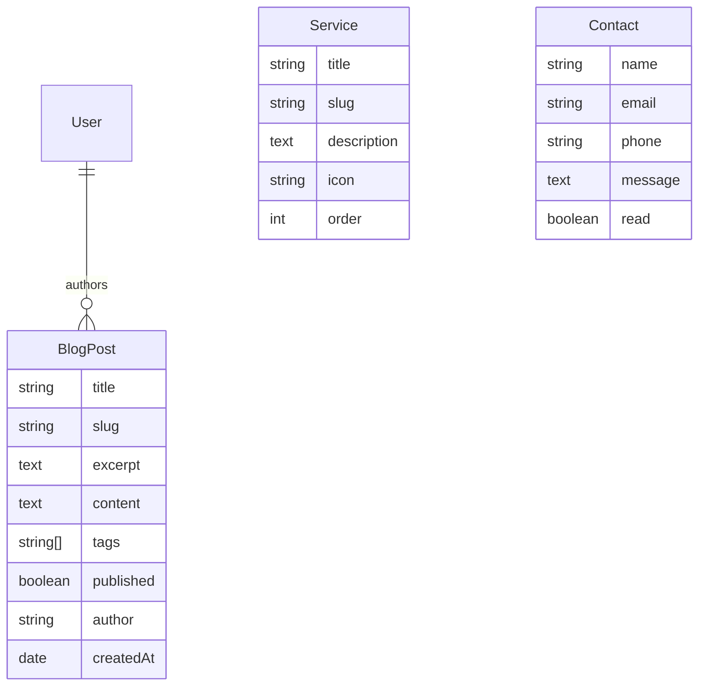

# LifiWeb2 — Architecture Guide

## Stack

| Layer | Tech | Rationale |
|-------|------|-----------|
| Framework | Next.js 16 (App Router + Turbopack) | SSR/CSR hybrid, RSC, file-based routing |
| Styling | Tailwind CSS v4 | CSS-first design tokens, dark mode native, `@theme` directive |
| Database | MongoDB 7 + Mongoose | Document DB, flexible for CMS content |
| Auth | NextAuth.js v5 (Auth.js) — Credentials | JWT sessions, admin-only auth |
| Proxy | `proxy.ts` (Next.js 16, replaces middleware) | Route-level auth guard for `/admin/*` |
| Icons | `@phosphor-icons/react` (60KB tree-shakeable) | Consistent, premium, Linear-style iconography |
| Font | Inter Variable via `next/font/google` | Linear-native typography (weight 510 H1) |
| Animation | `motion/react` (ex-Framer Motion) | Scroll reveals, micro-interactions, stagger |
| Assets | Cloudinary | Image/video upload via admin CMS + optimized delivery |
| Email | Resend (optional) | Contact form submissions |
| Validation | Zod | Form/API input validation |
| SEO | Dynamic sitemap + robots.txt + Open Graph | SSR metadata per page, geo-optimized |

## Directory Structure

```
src/
├── app/                          # Next.js App Router
│   ├── layout.tsx                # Root layout (Inter font, metadata, header/footer)
│   ├── page.tsx                  # Home page (SSR)
│   ├── globals.css               # Tailwind + Linear design tokens
│   ├── not-found.tsx             # Custom 404
│   ├── error.tsx                 # Error boundary (CSR)
│   ├── sitemap.ts                # Dynamic sitemap from blog posts
│   ├── robots.ts                 # Robots.txt with admin paths blocked
│   ├── about/page.tsx            # About page (SSR)
│   ├── services/page.tsx         # Services page (SSR)
│   ├── blog/
│   │   ├── page.tsx              # Blog list — SSR + pagination via URL searchParams
│   │   └── [slug]/page.tsx       # Blog detail — SSR, generateMetadata
│   ├── contact/
│   │   ├── page.tsx              # Contact page shell (SSR metadata)
│   │   └── ContactForm.tsx       # Contact form — CSR, fetch-based submit
│   ├── admin/
│   │   ├── layout.tsx            # Admin sidebar + SessionProvider
│   │   ├── login/page.tsx        # Admin login — CSR, signIn()
│   │   ├── dashboard/page.tsx    # Dashboard stats — SSR, dbConnect
│   │   ├── blog/
│   │   │   ├── page.tsx          # Blog CRUD list — SSR
│   │   │   └── [id]/
│   │   │       ├── page.tsx      # SSR shell with auth check
│   │   │       └── AdminBlogEditor.tsx  # CSR form
│   │   └── services/
│   │       ├── page.tsx          # Services CRUD list — SSR
│   │       └── [id]/
│   │           └── page.tsx      # Service editor
│   └── api/
│       ├── auth/[...nextauth]/route.ts  # NextAuth handlers
│       ├── blog/route.ts                # GET (list) + POST (create)
│       ├── blog/[id]/route.ts           # GET + PATCH + DELETE
│       ├── services/route.ts            # GET + POST
│       ├── services/[id]/route.ts       # GET + PATCH + DELETE
│       ├── contact/route.ts             # POST (public)
│       ├── upload/route.ts              # POST (Cloudinary upload, admin-only)
│       └── subscribe/route.ts           # GET (SSE heartbeat)
├── components/
│   ├── ui/                      # Primitive components
│   │   ├── Button.tsx           # primary/ghost/outline variants, loading state
│   │   ├── Card.tsx             # Hover-aware card container
│   │   ├── Input.tsx            # Label + error state
│   │   ├── Skeleton.tsx         # Shimmer loading placeholder
│   │   └── Badge.tsx            # Status badge
│   ├── layout/
│   │   ├── Header.tsx           # Floating island nav (CSR)
│   │   └── Footer.tsx           # Multi-column footer with links
│   └── sections/
│       ├── Hero.tsx             # Asymmetric hero with motion
│       ├── Features.tsx         # 3-column feature grid with icons
│       └── CTASection.tsx       # Bottom CTA banner
├── lib/
│   ├── mongodb.ts               # MongoDB connection singleton (cached global)
│   ├── auth.ts                  # NextAuth v5 config (Credentials provider)
│   ├── utils.ts                 # cn(), formatDate()
│   ├── constants.ts             # SITE metadata, NAV_LINKS
│   └── cloudinary/index.ts      # Cloudinary client + upload helpers
├── models/                      # Mongoose schemas
│   ├── User.ts                  # Admin user (email, password, role)
│   ├── BlogPost.ts              # title, slug, excerpt, content, tags, published
│   ├── Service.ts               # title, slug, description, icon, order
│   └── Contact.ts               # name, email, phone, message, read
├── proxy.ts                     # Next.js 16 auth guard for /admin/*
└── hooks/
    └── useSSE.ts                # EventSource subscription hook
```

## Data Models & Relations



> **ponytail note:** Relations are implicit through Mongoose. No populate needed — admin uses `userId` from session, blog queries by slug. Service icon names map to Phosphor icon components at render time.

## Rendering Patterns

| Page | Pattern | Why |
|------|---------|-----|
| Home, About, Services | SSR (Server Component) | Fastest initial load, SEO-critical |
| Blog list | SSR + searchParams pagination | Cacheable, works without JS |
| Blog detail | SSR + generateMetadata | Dynamic OG images, deep-linkable |
| Contact page | SSR shell + CSR form | Form needs client interactivity |
| **Admin** | SSR shell + auth check | Data fetched server-side |
| Admin blog editor | CSR form | Interactive editor, preview |
| SSE endpoint | Edge/Node stream | Real-time admin notifications |
| Admin login | CSR + signIn() | Credential form, redirect |

## Authentication Flow

```
Request → proxy.ts → auth() → session? → /admin/* (ok) | /admin/login (redirect)

Credentials login:
  /admin/login → signIn('credentials') → authorize() → JWT → cookie
```

- `proxy.ts` guards all `/admin/*` routes
- Login page uses CSR `signIn()` with redirect: false
- Admin layout uses `SessionProvider` for client-side session awareness
- Server components use `auth()` directly

## Design Tokens (Linear-aligned)

| Token | Value | Usage |
|-------|-------|-------|
| `--color-bg-primary` | #08090A | Page background |
| `--color-fg-primary` | #F7F8F8 | H1, H2 body text |
| `--color-fg-secondary` | #D0D6E0 | Body text |
| `--color-fg-tertiary` | #8A8F98 | Caption, meta |
| `--color-accent` | #7170FF | Primary CTA, links |
| `--color-line-primary` | #37393A | Borders, dividers |
| `--font-size-display` | 64px / -1.408px ls | H1 hero |
| `--font-size-title` | 1.0625rem (17px) | H3, card titles |
| `--font-size-regular` | 0.9375rem (15px) | Body |
| `--font-size-small` | 0.875rem (14px) | Meta, nav |
| `--font-size-tiny` | 0.75rem (12px) | Labels, badges |

## Cloudinary Integration

- Upload via `/api/upload` (multipart, admin-only)
- Transformations: `q_auto`, `f_auto`
- Images stored in `lifistudio` folder
- Frontend renders via Cloudinary URL directly or `<Image>` with optimized URL
- Config via env vars: `CLOUDINARY_CLOUD_NAME`, `CLOUDINARY_API_KEY`, `CLOUDINARY_API_SECRET`

## SEO & i18n/Geo

- Dynamic sitemap at `/sitemap.xml` — includes all static pages + published blog posts
- `robots.ts` blocks `/admin/` and `/api/`
- Metadata per page via `generateMetadata` or `export const metadata`
- JSON-LD structured data (Organization, WebSite, BlogPosting)
- Open Graph tags for social sharing
- `hreflang` support ready for multi-language (Indo/English)

## Setup

```bash
# 1. Start MongoDB
docker run -d --name lifiweb2-mongo -p 27017:27017 mongo:7

# 2. Environment
cp .env.example .env.local
# Fill in: MONGODB_URI, NEXTAUTH_SECRET, CLOUDINARY_*

# 3. Install & seed
npm install
npx tsx scripts/seed.ts

# 4. Run
npm run dev
```

## Quick Reference

| Command | Description |
|---------|-------------|
| `npm run dev` | Dev server (port 3000) |
| `npm run build` | Production build |
| `npx tsx scripts/seed.ts` | Seed admin user + sample post |
| Admin login | `admin@lifistudio.id` / `admin123` |
| Admin URL | `/admin/login` then `/admin/dashboard` |
| Upload image | Admin blog editor → `/api/upload` |
